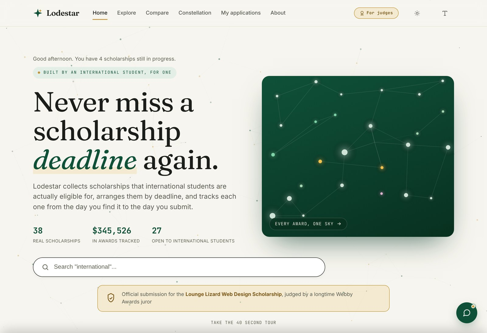

# Lodestar

**A scholarship tracker built by an international student, for international students.**

Live site: **https://danghoang2605-ds-ai.github.io/lodestar/**

Lodestar is my submission for the [Lounge Lizard Web Design Scholarship](https://www.loungelizard.com/scholarship/) (Fall 2026). It is a working tool, not a mockup: it collects scholarships that international students can actually apply to, lays them out by deadline, and tracks each application from the day you find it to the day you submit.

## Why I built it

Search for scholarships as an F-1 student and you get thousands of results, then discover in the fine print that citizenship is required. I kept my search in a messy spreadsheet and twenty open tabs, and I still missed deadlines. Lodestar is the tool I wanted instead.

## What it does

- **Explore:** filter 38 scholarships by effort (essay, no essay, portfolio), field, international eligibility, deadline window, and award size. Grid or table view, shareable filter links.
- **Constellation:** every scholarship drawn as a star, sized by award and coloured by field, so the whole search is visible at a glance. Drag to pan, scroll or pinch to zoom.
- **Deadline horizon:** the nearest deadlines on one timeline, with this week's shaded in red.
- **My applications:** a Kanban board (not started, in progress, submitted) that remembers where you left off. Cards move by drag, keyboard, or on-card arrows for phones.
- **Scholarship pages:** a live countdown, checklist, notes with version history, recommender tracking, essay snippets you can reuse across similar prompts, and a transparent breakdown of why each one matched.
- **Compare:** up to four scholarships side by side.
- **Your school and loans:** UGA-specific aid, and a plain reference for federal loan types with a clear note on international eligibility.
- **Exports:** calendar (.ics) reminders, CSV, printable summaries, and a JSON backup you can restore on another device.

## Design and accessibility

- **Type:** Fraunces for headings, Inter for body text, JetBrains Mono for numbers and dates.
- **Colour:** warm paper, deep green, gold and coral, with a separately tuned dark theme. The built-in design system page computes every contrast ratio live in both themes.
- **Urgency is never colour alone:** each deadline pill also carries a shape.
- **Reduced motion is respected:** the animated sky, scroll reveals and cursor effects switch off when the system asks for less motion.
- **Keyboard support:** `/` to search, `Ctrl+K` command palette, `1` to `5` to switch screens, `?` for the full list.
- **Responsive:** checked from a 375 px phone up to a wide desktop.

## Built with

Plain HTML, CSS and JavaScript in a single file. No framework, no build step, no backend, no external charting library. Every chart and the constellation view are drawn by hand in SVG or on a canvas. Your data stays in your own browser (localStorage).

## A note on the data

The scholarships are real and gathered from public listings, but most deadlines and amounts are shown as representative values and move with today's date so the demo stays useful. The exceptions are the Lounge Lizard deadline (October 4, 2026) and the 2026 to 2027 federal loan rates, which were checked against their official pages. Always confirm details on each provider's site before applying.

## Run it locally

Download `index.html` and open it in any modern browser. That is the whole setup.

## Author

**Dang Hoang**, Data Science and Mathematics, University of Georgia
